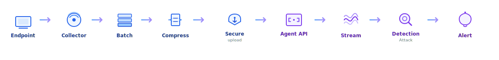
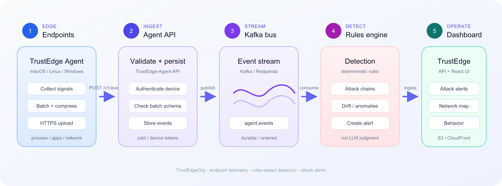
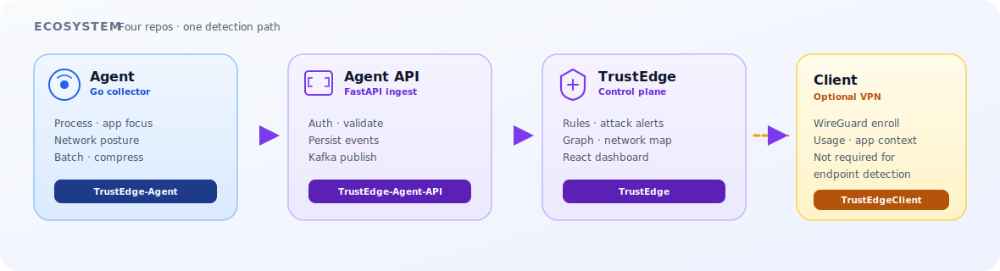
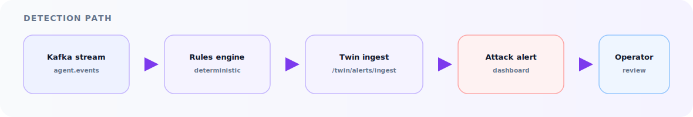
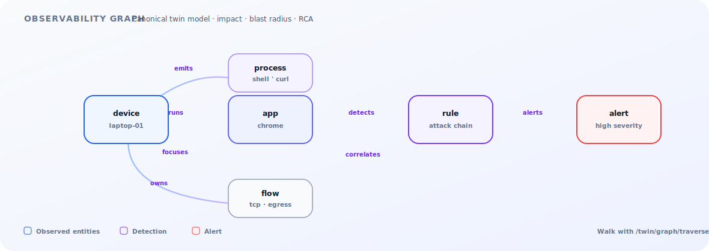

#  TrustEdge

### Self-hosted security observability

**Endpoint telemetry · rules-based detection · attack alerts**

React dashboard · FastAPI control plane · TrustEdge Agent · Agent API · AWS

 

  

---

##  TrustEdge architecture

How the stack fits together — edge collection, secure ingest, stream detection, and the operator dashboard.

  

| Layer | What lives here |
|-------|-----------------|
| **Edge** | TrustEdge Agent — collect · batch · compress · HTTPS |
| **Ingest** | Agent API — auth · validate · persist · publish |
| **Stream** | Kafka / Redpanda — durable `agent.events` bus |
| **Detection** | Rules engine — deterministic attack / drift rules |
| **Control plane** | FastAPI · Twin — alerts, graph, maps, devices |
| **Dashboard** | React · S3 · CloudFront — operator views |

---

##  Ecosystem map

Three repositories, one detection path.

  

| Repository | Role |
|------------|------|
| [**TrustEdge**](https://github.com/TrustEdgeOrg/TrustEdge/tree/docs/readme-endpoint-focus) | Control plane · dashboard · detection |
| [**TrustEdge-Agent**](https://github.com/TrustEdgeOrg/TrustEdge-Agent) | Endpoint collector (Go) |
| [**TrustEdge-Agent-API**](https://github.com/TrustEdgeOrg/TrustEdge-Agent-API) | Ingest · validate · Kafka |

---

##  Detection path

Rules stay deterministic. LLMs only explain — they do not decide.

  

---

##  Observability graph

Canonical twin model for impact analysis, blast radius, and RCA — entities and dependencies, not a layout toy.

  

---

## Platform at a glance

| Capability | Implementation |
|------------|----------------|
| Endpoint telemetry | TrustEdge Agent → Agent API → stream |
| Detection | Kafka-backed rules → attack alerts |
| Observability | Network map · client map · behavior drift · graph |
| AI operations | Optional summaries (OpenAI / Ollama / template) |
| Production ops | CloudWatch · Alembic · ECR deploy |

---

## Tech stack

`React` · `TypeScript` · `FastAPI` · `Go` · `PostgreSQL` · `Redis` · `Kafka/Redpanda` · `AWS`

---

**Docs:** [Architecture](https://github.com/TrustEdgeOrg/TrustEdge/blob/docs/readme-endpoint-focus/docs/SYSTEM_ARCHITECTURE.md) · [TrustEdge README](https://github.com/TrustEdgeOrg/TrustEdge/blob/docs/readme-endpoint-focus/README.md) · [Org](https://github.com/TrustEdgeOrg)
