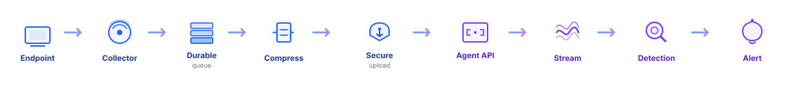
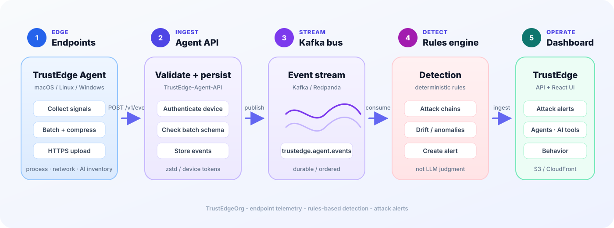
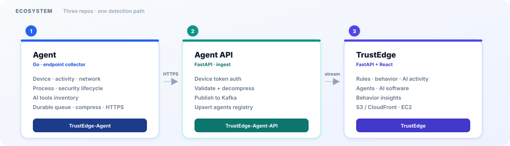
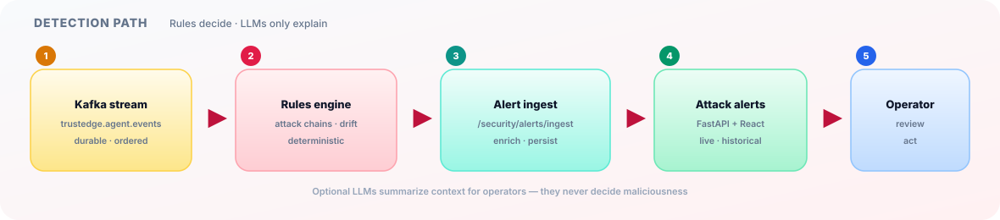
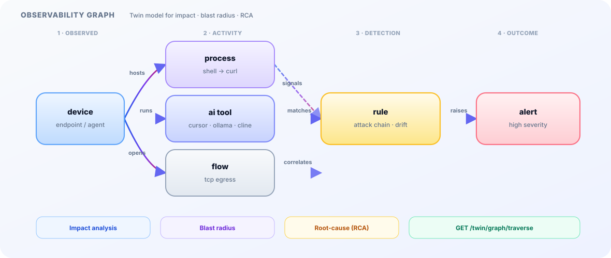

#  TrustEdge

### Self-hosted security observability

**Endpoint telemetry · rules + behavior detection · attack alerts**

React dashboard · FastAPI control plane · TrustEdge Agent · Agent API · AWS

 

## About the project

TrustEdge is a **self-hosted security observability platform**. It gives teams real endpoint signal and actionable detection without a heavyweight enterprise EDR stack.

A lightweight [TrustEdge Agent](https://github.com/TrustEdgeOrg/TrustEdge-Agent) runs on macOS, Linux, and Windows and collects:

- **Device & activity** — OS posture, foreground focus, idle vs active
- **Network** — connectivity summary, posture, and new TCP connection samples
- **Processes** — start and exit lifecycle
- **Security lifecycle** — drivers, services, and persistence (macOS / Windows)
- **AI tools inventory** — apps, CLI agents, local model runtimes, and IDE extensions

Collectors stay on the device. Events land in a **durable on-disk queue**, then are compressed (**zstd**) and uploaded over **HTTPS with a device token** to [TrustEdge-Agent-API](https://github.com/TrustEdgeOrg/TrustEdge-Agent-API). From there, Kafka streams events into detection. The [TrustEdge](https://github.com/TrustEdgeOrg/TrustEdge) control plane shows **attack alerts**, the **agents** registry, **installed AI software**, **behavior** baselines, and **AI activity sessions** in a React dashboard.

Detection is multi-engine and deterministic:

- **YAML attack/chain rules** — process, network, and security lifecycle patterns
- **Behavioral engine** — per-device baselines and novel-process alerts
- **AI activity engine** — agentic session reconstruction and AI-tool findings

Optional LLMs (**Ollama** / OpenAI / templates) can **explain** alerts and summarize network state for operators — they never decide what is malicious.

Built for portfolio and educational use, with AWS deploy and GitHub Actions CI/CD.

  

<em>Overview — network health, live agents, recent alerts, and severity</em>

  

---

##  TrustEdge architecture

Five stages from the endpoint to the operator dashboard.

  

| Layer | What lives here |
|-------|-----------------|
| **Edge** | TrustEdge Agent (Go) — collect · durable queue · zstd · HTTPS |
| **Ingest** | Agent API (FastAPI) — device auth · validate · publish · live twin |
| **Stream** | Kafka / Redpanda — durable `trustedge.agent.events` bus |
| **Detection** | Attack/chain rules · behavior baselines · AI activity → alerts |
| **Operate** | FastAPI + React — alerts, agents, AI inventory, behavior, sessions |
| **Data** | PostgreSQL (RDS) · Redis — source of truth · live twin state |
| **Hosting** | EC2 + Docker Compose · S3 + CloudFront · ECR |

Production layout: [TrustEdge AWS deploy docs](https://github.com/TrustEdgeOrg/TrustEdge/blob/main/docs/DEPLOY.md)

---

##  Ecosystem map

Three repositories. One detection path — collect on the endpoint, ingest securely, then detect and operate.

  

| Repository | Role |
|------------|------|
| [**TrustEdge**](https://github.com/TrustEdgeOrg/TrustEdge) | Control plane · dashboard · detection |
| [**TrustEdge-Agent**](https://github.com/TrustEdgeOrg/TrustEdge-Agent) | Endpoint collector (Go) |
| [**TrustEdge-Agent-API**](https://github.com/TrustEdgeOrg/TrustEdge-Agent-API) | Ingest · validate · Kafka · twin |

---

## Operator surfaces

| Surface | What operators see |
|---------|--------------------|
| **Home** | Health, recent alerts, agent status, AI network overview |
| **Agents** | Registry + per-agent twin, timeline, AI software, behavior, AI sessions |
| **Alerts** | Severity/category filters, process chain/graph evidence, **Explain with Ollama** |
| **Learn** | How the agent pipeline works · how detection works |

---

##  Detection path

Kafka feeds attack/chain rules, the behavioral engine, and AI activity analysis. Alerts are ingested into the control plane for operators to review. LLMs may summarize — they do not judge.

  

---

##  Observability graph

The twin graph connects **devices → processes / AI tools / flows → rules (attack + behavior) → alerts**. Use it for **impact analysis**, **blast radius**, and **root-cause analysis** — not decoration.

  

---

## Platform at a glance

| Capability | Implementation |
|------------|----------------|
| Endpoint telemetry | Device, activity, network summary + connections, process, security lifecycle, AI tools |
| Reliable delivery | Durable queue · zstd · HTTPS · retry with backoff |
| Detection | YAML rules · behavior baselines / novelty · AI activity sessions |
| Observability | Alerts · agents · AI inventory · behavior · AI sessions · twin graph |
| Operator assist | Optional Ollama / OpenAI / template explain & overview |
| Production ops | EC2 + Docker Compose · RDS · S3/CloudFront · ECR · GitHub Actions |

---

## Tech stack

`React` · `TypeScript` · `FastAPI` · `Go` · `PostgreSQL` · `Redis` · `Kafka/Redpanda` · `Docker` · `AWS`

---

**Docs:** [Architecture](https://github.com/TrustEdgeOrg/TrustEdge/blob/main/docs/SYSTEM_ARCHITECTURE.md) · [TrustEdge README](https://github.com/TrustEdgeOrg/TrustEdge/blob/main/README.md) · [Agent](https://github.com/TrustEdgeOrg/TrustEdge-Agent) · [Org](https://github.com/TrustEdgeOrg)
